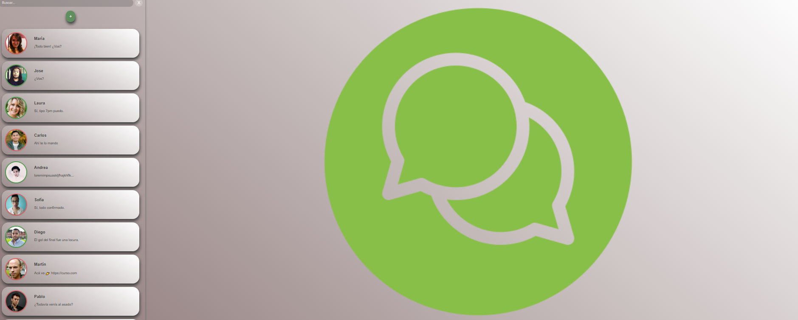
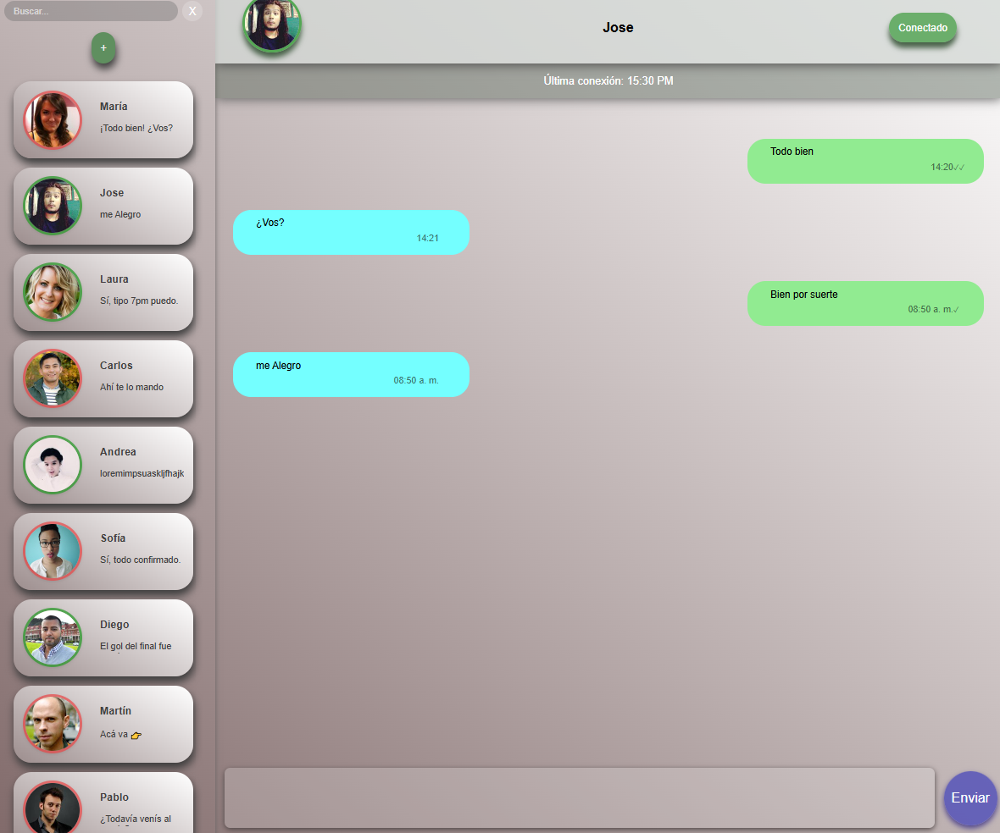
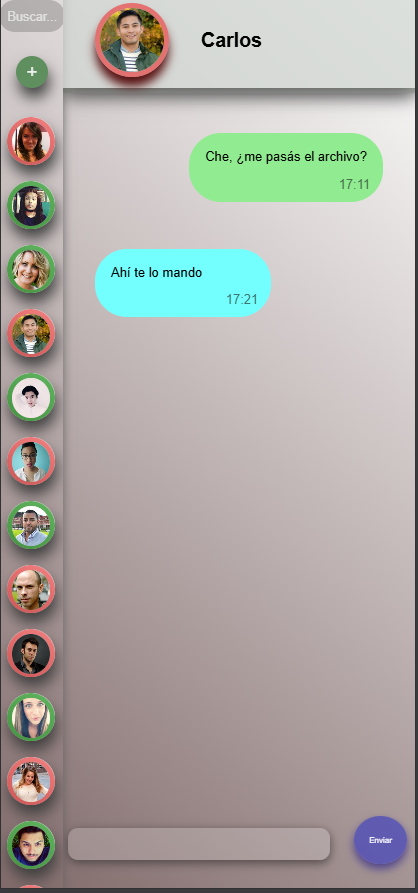

# Clon de Chat - Trabajo Integrador

Esta aplicación es un clon de chat desarrollado con React y CSS nativo, cuyo objetivo es simular el funcionamiento básico de una app de mensajería.
El proyecto se centra en el manejo de componentes, props, estados, hooks personalizados y estilos responsive

## Estructura del proyecto

El proyecto se divide en dos paneles:

- Panel lateral Izquierdo (lista de contactos)
  Incluye:

  - Barra de búsqueda para filtrar contactos por nombre.

  - Botón para crear un nuevo contacto.

  - Listado de contactos en formato de tarjetas (cards), mostrando:

    - Foto de perfil
    - Nombre
    - Último mensaje recibido

- Panel lateral Derecho(Panel Chat):
  Contiene:

  - Información del contacto seleccionado (nombre, avatar, última conexión).

  - Historial de mensajes con formato tipo “burbuja”.

  - Mensajes enviados: alineados a la derecha.

  - Mensajes recibidos: alineados a la izquierda.

  - Barra inferior para escribir nuevos mensajes.

  - Envío automático de una respuesta aleatoria, simulando una conversación real (implementado con un hook personalizado).

## Tecnologias usadas:

- React

- JavaScript

- CSS nativo

## Instrucciones para ejecutar el proyecto:

1. clonar repositorio

```
https://github.com/JDamianDelgado/Clone-Chat-React.git

```

2. Instalar dependencias

```

npm install

```

3. Ejecutar Proyecto

```

npm run dev

```

## URL proyecto

[Clon De Chat en Vercel](https://clone-chat-react.vercel.app/)

## Capturas de proyecto







### Autor

Nombre: Joaquín Damián Delgado

Curso: Diplomatura Full Stack

Trabajo Integrador - React Js

Fecha: Noviembre 2025
